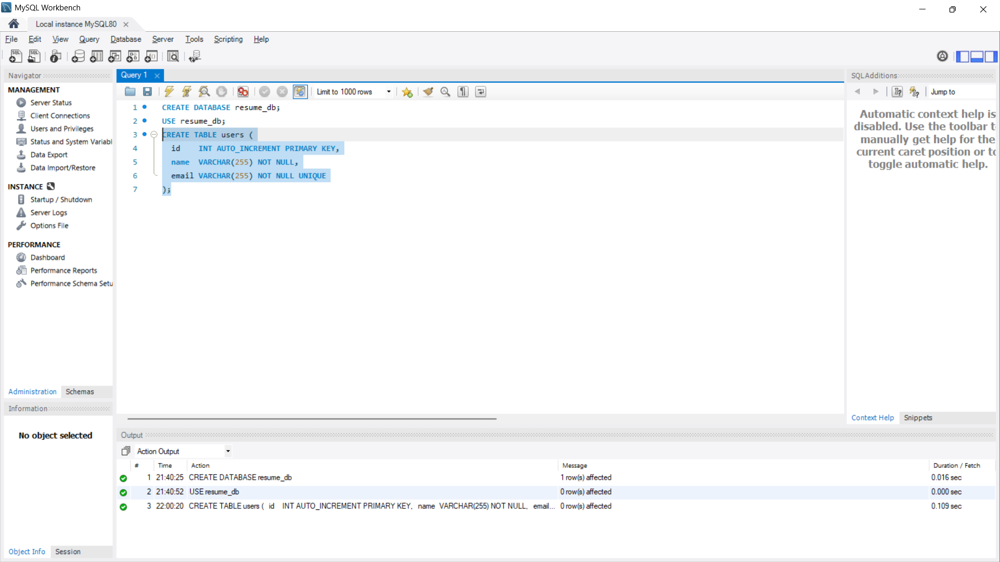
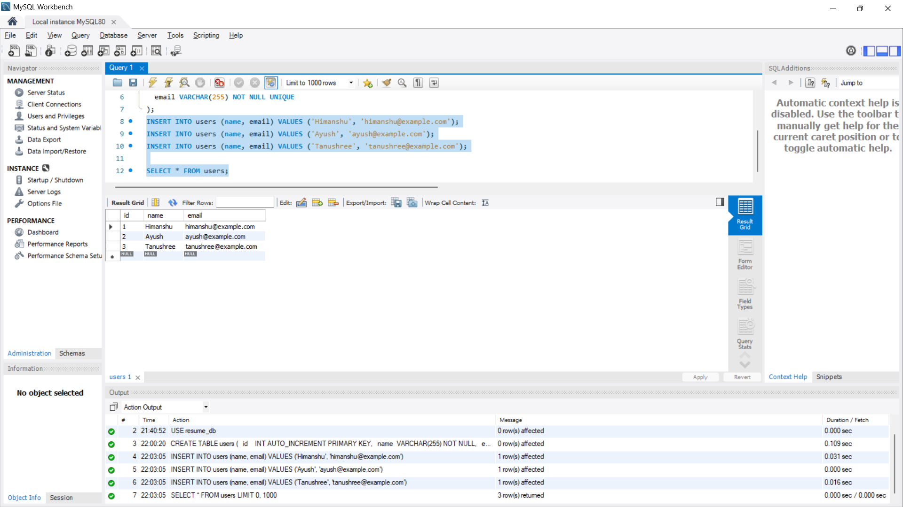
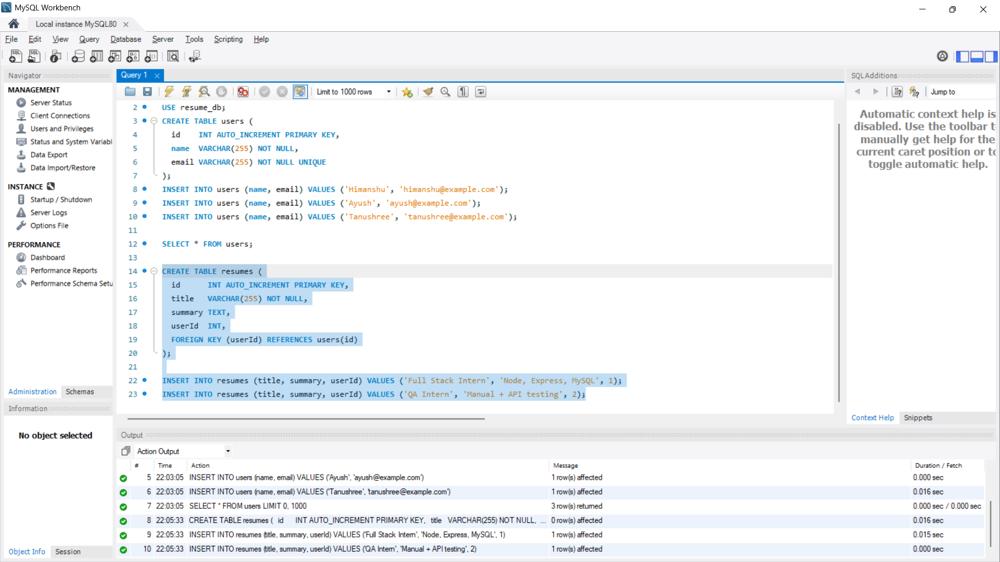
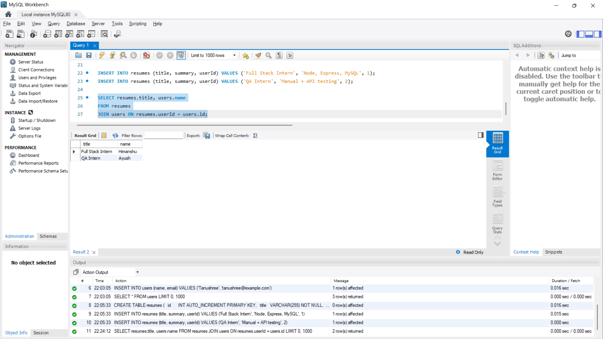

# Day 18 · Class 1 — MySQL, Tables & Joins

## Overview

This class moves the resume project from a plain `data.json` file to a real MySQL database. It covers installing MySQL, creating a database and table by hand in Workbench, inserting/reading rows, and the two core relational ideas: **joins** and **normalization**.

## 1. Why a File Is Not Enough

- **Data gets lost** — if two users save at the same time, the second write silently overwrites the first. No error, data just vanishes.
- **Search is slow** — finding one record in a file means loading everything and looping through it. With thousands of rows this doesn't scale.

**MySQL** solves both: a dedicated database server that stores data safely (even with many concurrent users) and finds it instantly.

## 2. Install MySQL & MySQL Workbench

| Component | What it is |
|---|---|
| **MySQL Server** | The database engine that stores everything. Runs in the background. |
| **MySQL Workbench** | The GUI to talk to it — write SQL, view tables, browse data. |

- During install, you set a **root password** — remember it. `root` is the admin user, needed to connect from Workbench and later from Node.
- Connect to `localhost` with user `root` and your password.
- ⚠️ Almost every "cannot connect" issue traces back to a wrong root password. If forgotten, the simplest fix is to reinstall MySQL and set a new one.


## 3. Create a Database

```sql
CREATE DATABASE resume_db;
USE resume_db;
```

**Mental model:** Server → Databases → Tables → Rows (like folders inside folders).


## 4. Create a Table

```sql
CREATE TABLE users (
  id    INT AUTO_INCREMENT PRIMARY KEY,
  name  VARCHAR(255) NOT NULL,
  email VARCHAR(255) NOT NULL UNIQUE
);
```

- `AUTO_INCREMENT` — id increases automatically per row
- `PRIMARY KEY` — uniquely identifies each row
- `NOT NULL` — column can't be empty
- `UNIQUE` — no two rows can share this value (e.g. no duplicate emails)



## 5. Insert & Read Data

```sql
INSERT INTO users (name, email) VALUES ('Himanshu', 'himanshu@example.com');
INSERT INTO users (name, email) VALUES ('Ayush', 'ayush@example.com');
INSERT INTO users (name, email) VALUES ('Tanushree', 'tanushree@example.com');

SELECT * FROM users;
```

Filter with `WHERE`:

```sql
SELECT * FROM users WHERE email = 'ayush@example.com';
```

⚠️ **`WHERE` is not optional on `UPDATE`/`DELETE`.**
`DELETE FROM users;` with no `WHERE` deletes *every* row.
`DELETE FROM users WHERE id = 2;` deletes exactly one.



## 6. Foreign Keys — Linking Tables

A resume belongs to a user, so a second table connects to `users` via a **foreign key**:

```sql
CREATE TABLE resumes (
  id      INT AUTO_INCREMENT PRIMARY KEY,
  title   VARCHAR(255) NOT NULL,
  summary TEXT,
  userId  INT,
  FOREIGN KEY (userId) REFERENCES users(id)
);

INSERT INTO resumes (title, summary, userId) VALUES ('Full Stack Intern', 'Node, Express, MySQL', 1);
INSERT INTO resumes (title, summary, userId) VALUES ('QA Intern', 'Manual + API testing', 2);
```

- `resumes.userId` holds a `users.id` — e.g. `userId = 1` means that resume belongs to Himanshu.
- Note: `summary` is `TEXT`, not `VARCHAR`. `VARCHAR` caps at 255 characters; `TEXT` holds longer content. Picking the right type is part of table design.



## 7. Joins

A **join** combines rows from two tables by matching a column, so related data can be read together in one query.

```sql
SELECT resumes.title, users.name
FROM resumes
JOIN users ON resumes.userId = users.id;
```

```
+-------------------+----------+
| title             | name     |
+-------------------+----------+
| Full Stack Intern | Himanshu |
| QA Intern         | Ayush    |
+-------------------+----------+
```

This is the heart of a relational database: data lives in separate tables and joins bring it back together on demand.



## 8. Normalization

**Why not one big table** with the user's name/email repeated on every resume row?

**Un-normalized (bad):**
```
Full Stack Intern | Himanshu | himanshu@example.com
QA Intern         | Himanshu | himanshu@example.com
```
Problems:
1. **Waste** — the same data stored repeatedly.
2. **Update anomalies** — if Himanshu's email changes, you'd have to hunt down and update every row that copied it.

**Normalized (good):** store each fact once (in `users`), and let `resumes` point to it by `id`. Change the email once in `users`, and every resume sees the new value instantly through the join.

## Author
Ayush Joshi